# Employee Attrition Prediction

## Project Overview
Proyek ini bertujuan untuk menganalisis faktor-faktor yang memengaruhi keputusan karyawan untuk mengundurkan diri (attrition) serta membangun model prediktif berbasis machine learning. Tingginya angka pengunduran diri dapat menyebabkan kerugian finansial dan hilangnya talenta penting, sehingga analisis ini diharapkan dapat membantu tim HR dalam merancang kebijakan retensi yang lebih tepat dan strategis.

## Latar Belakang

Turnover karyawan merupakan tantangan besar bagi perusahaan. Biaya yang ditimbulkan mencakup pelatihan, perekrutan ulang, hingga penurunan produktivitas. Oleh karena itu, diperlukan analisis untuk memahami faktor-faktor pemicu agar strategi pencegahan dapat dilakukan.

## Business Understanding  

Perusahaan ingin menurunkan angka pengunduran diri dengan memahami siapa saja karyawan yang berpotensi resign serta faktor-faktor yang mempengaruhinya. Tingginya tingkat attrition menjadi tantangan besar dalam manajemen SDM, sehingga penting bagi perusahaan untuk mengenali karakteristik karyawan berisiko tinggi agar dapat mengambil tindakan preventif, seperti meningkatkan kepuasan kerja, memberikan promosi tepat waktu, serta menyusun kebijakan kompensasi dan perbaikan lingkungan kerja yang efektif.

### Problem Statements  
Perusahaan belum memiliki pemahaman yang jelas mengenai karyawan yang berpotensi mengundurkan diri serta faktor-faktor yang mempengaruhi keputusan tersebut. Keterbatasan informasi ini menghambat perencanaan strategi retensi yang efektif dan tepat sasaran.

### Goals  
- Memprediksi kemungkinan seorang karyawan mengundurkan diri menggunakan teknik machine learning.  
- Mengidentifikasi fitur-fitur utama yang berkontribusi signifikan terhadap attrition.  
- Memberikan insight actionable yang dapat digunakan oleh tim HR untuk meningkatkan retensi karyawan.

### Solution Statements  
- Melakukan Exploratory Data Analysis (EDA) guna menggali pola dan insight dari data historis.  
- Melakukan pembersihan data serta feature engineering untuk mempersiapkan dataset yang optimal bagi pemodelan.  
- Melatih dan membandingkan performa model prediktif menggunakan Logistic Regression dan Random Forest.  
- Mengevaluasi hasil model dan menginterpretasi fitur-fitur penting yang mempengaruhi keputusan resign.

## Data Understanding

Dataset yang digunakan dalam proyek ini merupakan data karyawan dari sebuah perusahaan fiktif yang dibuat oleh tim data scientist IBM dan tersedia secara publik di [Kaggle](https://www.kaggle.com/datasets/pavansubhasht/ibm-hr-analytics-attrition-dataset)
. Dataset ini mencakup informasi demografis, status pekerjaan, riwayat kerja, kepuasan kerja, serta status pengunduran diri (attrition) dari 1.470 karyawan.

Atribut-atribut yang tersedia dijelaskan pada Tabel 1 berikut.

## Tabel 1. Atribut Dataset

| No | Atribut                  | Keterangan                                      | Tipe Data |
| -- | ------------------------ | ----------------------------------------------- | --------- |
| 0  | Age                      | Usia karyawan                                   | int64     |
| 1  | Attrition                | Target apakah karyawan resign (Yes/No)          | object    |
| 2  | BusinessTravel           | Frekuensi perjalanan bisnis                     | object    |
| 3  | DailyRate                | Gaji harian                                     | int64     |
| 4  | Department               | Departemen tempat bekerja                       | object    |
| 5  | DistanceFromHome         | Jarak dari rumah ke kantor (dalam satuan mil)   | int64     |
| 6  | Education                | Tingkat pendidikan (1–5)                        | int64     |
| 7  | EducationField           | Bidang pendidikan                               | object    |
| 8  | EmployeeCount            | Jumlah karyawan (selalu 1 → fitur konstan)      | int64     |
| 9  | EmployeeNumber           | ID unik karyawan                                | int64     |
| 10 | EnvironmentSatisfaction  | Kepuasan terhadap lingkungan kerja (1–4)        | int64     |
| 11 | Gender                   | Jenis kelamin                                   | object    |
| 12 | HourlyRate               | Gaji per jam                                    | int64     |
| 13 | JobInvolvement           | Tingkat keterlibatan pekerjaan (1–4)            | int64     |
| 14 | JobLevel                 | Level jabatan                                   | int64     |
| 15 | JobRole                  | Nama jabatan                                    | object    |
| 16 | JobSatisfaction          | Kepuasan terhadap pekerjaan (1–4)               | int64     |
| 17 | MaritalStatus            | Status pernikahan                               | object    |
| 18 | MonthlyIncome            | Gaji bulanan                                    | int64     |
| 19 | MonthlyRate              | Gaji bulanan (rate-based)                       | int64     |
| 20 | NumCompaniesWorked       | Jumlah perusahaan sebelumnya                    | int64     |
| 21 | Over18                   | Apakah berusia >18 (selalu ‘Y’ → fitur konstan) | object    |
| 22 | OverTime                 | Apakah bekerja lembur                           | object    |
| 23 | PercentSalaryHike        | Persentase kenaikan gaji                        | int64     |
| 24 | PerformanceRating        | Rating performa kerja                           | int64     |
| 25 | RelationshipSatisfaction | Kepuasan relasi interpersonal di tempat kerja   | int64     |
| 26 | StandardHours            | Jam kerja standar (selalu 80 → fitur konstan)   | int64     |
| 27 | StockOptionLevel         | Level opsi saham                                | int64     |
| 28 | TotalWorkingYears        | Total tahun pengalaman kerja                    | int64     |
| 29 | TrainingTimesLastYear    | Frekuensi pelatihan dalam setahun terakhir      | int64     |
| 30 | WorkLifeBalance          | Keseimbangan kerja-hidup (1–4)                  | int64     |
| 31 | YearsAtCompany           | Lama bekerja di perusahaan saat ini             | int64     |
| 32 | YearsInCurrentRole       | Lama menjabat posisi saat ini                   | int64     |
| 33 | YearsSinceLastPromotion  | Lama sejak promosi terakhir                     | int64     |
| 34 | YearsWithCurrManager     | Lama bekerja dengan atasan saat ini             | int64     |

### Exploratory Data Analysis (EDA)
1. Berapa Persentase Karyawan yang Resign?

    Dari keseluruhan data, sekitar 16% karyawan menyatakan resign (label Attrition = Yes). Meskipun mayoritas karyawan tetap bertahan, angka ini tidak bisa diabaikan karena tingkat attrition yang tinggi dapat berdampak signifikan terhadap biaya operasional, produktivitas, dan stabilitas tim di perusahaan.

    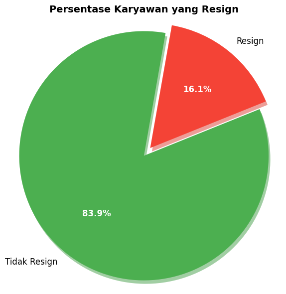
  

2. Apakah Usia Muda Lebih Sering Resign?

    Karyawan berusia di bawah 31 tahun menunjukkan tingkat pengunduran diri tertinggi, yaitu mencapai 38%. Fakta ini menandakan bahwa kelompok usia muda cenderung lebih aktif dalam mencari peluang karier baru atau merasa kurang cocok dengan lingkungan kerja saat ini, sehingga keputusan untuk resign terjadi lebih awal dalam masa kerja mereka.

   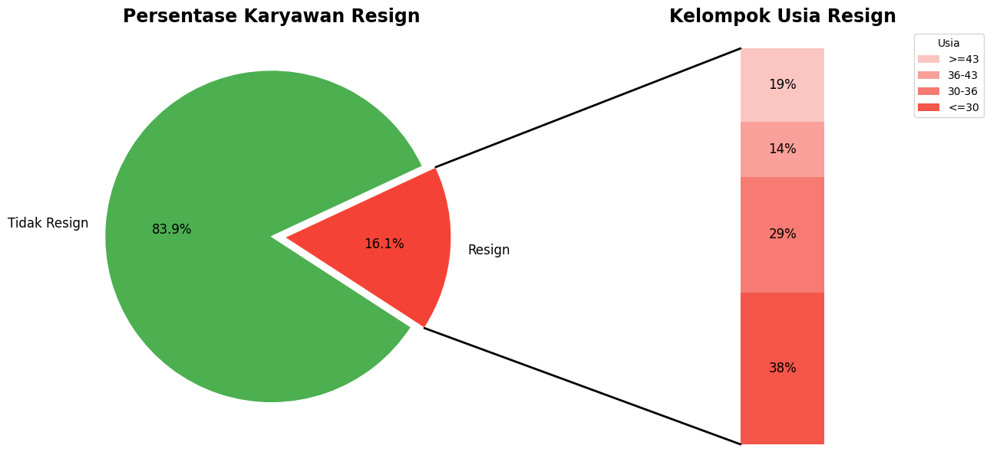
     Gambar 2. Distribusi Usia Berdasarkan Status Attrition
  
3. Apa Pengaruh Marital Status terhadap Resign?

    Status pernikahan turut memengaruhi kecenderungan karyawan untuk resign. Karyawan yang berstatus single mencatat tingkat attrition tertinggi sebesar 25.5%, jauh lebih tinggi dibandingkan dengan mereka yang sudah menikah (12.5%) atau bercerai (10.1%). Hal ini bisa jadi karena fleksibilitas dalam mobilitas karier atau minimnya tanggungan keluarga, sehingga mempermudah keputusan untuk berpindah pekerjaan.

   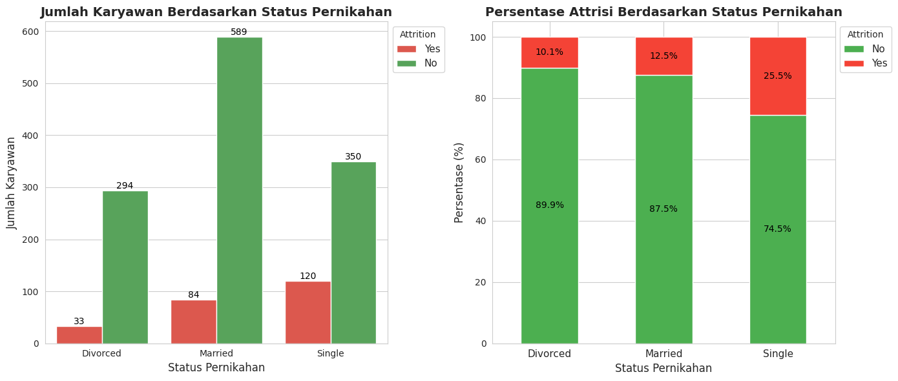
   Gambar 3. Attrition Berdasarkan Status Pernikahan

4. Apakah Jarak ke Kantor Mempengaruhi Keputusan Resign?

    Jarak tempuh antara rumah dan kantor ternyata berperan dalam keputusan resign. Karyawan yang tinggal lebih jauh menunjukkan kecenderungan attrition yang lebih tinggi. Faktor seperti lamanya perjalanan, biaya transportasi, dan dampaknya terhadap keseimbangan hidup dan kerja, kemungkinan besar memicu ketidakpuasan yang berujung pada keputusan untuk meninggalkan perusahaan

    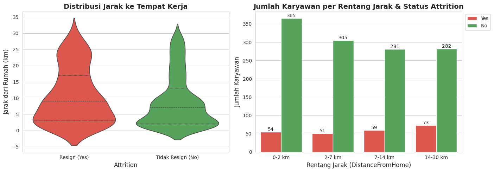
  Gambar 4. Jarak dari Rumah Berdasarkan Status Attrition
   
5. Job Role Mana yang Paling Banyak Resign?

    Peran pekerjaan dengan tingkat attrition tertinggi adalah Sales Representative. Hal ini dapat dikaitkan dengan tekanan target yang tinggi, dinamika pasar yang fluktuatif, atau tuntutan kerja yang lebih kompetitif. Profesi ini sering kali memiliki turnover rate yang tinggi karena karakteristik pekerjaan yang menantang dan intens.

    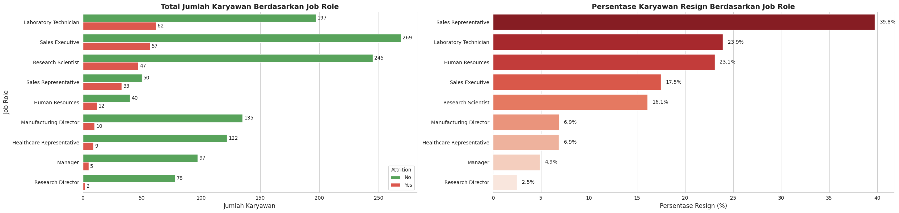
    Gambar 5. Tingkat Attrition Berdasarkan Job Role

6. Apakah Level Jabatan (JobLevel) Mempengaruhi Attrition?
    
    Tingkat jabatan (JobLevel) menunjukkan hubungan langsung dengan tingkat attrition. Karyawan pada level entry-level memiliki kecenderungan resign yang lebih tinggi dibandingkan dengan mereka yang berada di jenjang karier menengah atau atas. Hal ini bisa dipicu oleh keinginan untuk mencari kenaikan jabatan, ekspektasi awal yang tidak terpenuhi, atau keterbatasan ruang tumbuh dalam posisi mereka saat ini.
    
    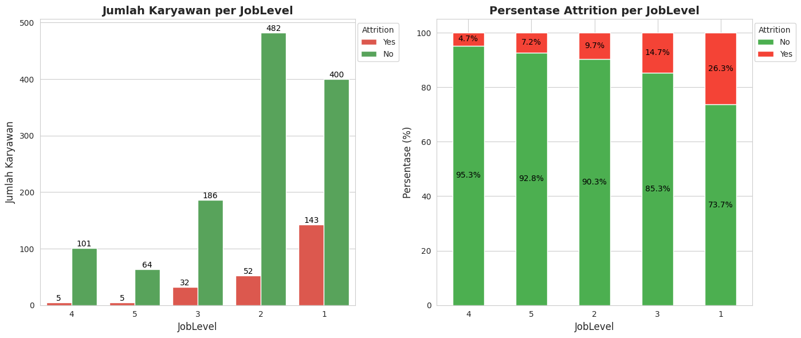
    Gambar 6. Attrition Berdasarkan Job Level

7. Apakah Karyawan Baru (<2 Tahun) Lebih Rentan Resign?

    Karyawan dengan masa kerja kurang dari dua tahun memiliki tingkat resign yang jauh lebih tinggi dibandingkan mereka yang sudah bekerja lebih lama. Hal ini menandakan bahwa fase awal pekerjaan merupakan masa kritis dalam retensi karyawan, di mana faktor adaptasi, budaya perusahaan, dan kepuasan awal sangat memengaruhi keputusan untuk bertahan atau tidak.

    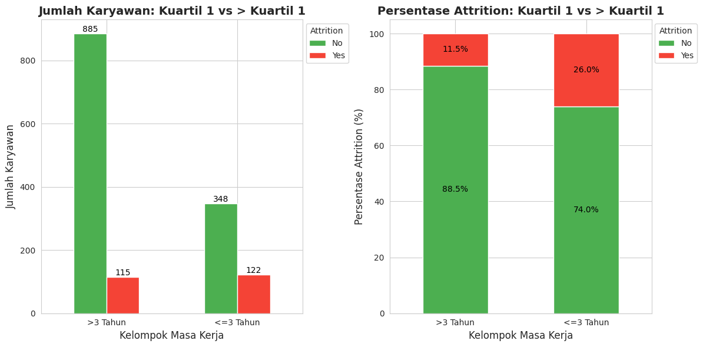
  Gambar 7. Attrition Berdasarkan Lama Bekerja di Perusahaan

8. Apakah Gaji Rendah Berkorelasi dengan Attrition?
    
    Hasil analisis menunjukkan bahwa karyawan dengan gaji bulanan yang lebih rendah memiliki probabilitas resign yang lebih tinggi. Keterbatasan penghasilan dapat memicu ketidakpuasan, terutama jika tidak sebanding dengan beban kerja atau kebutuhan hidup. Sebaliknya, gaji yang kompetitif cenderung memberikan rasa aman dan loyalitas terhadap perusahaan.

    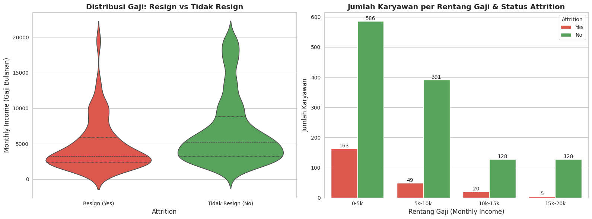
  Gambar 8. Distribusi Monthly Income Berdasarkan Status Attrition

9. Apakah Ada Perbedaan Attrition antar Department?
    
    Setiap departemen menunjukkan tingkat attrition yang berbeda-beda. Departemen Sales memiliki persentase angka pengunduran diri yang lebih tinggi, kemungkinan karena tingginya tekanan kinerja dan tuntutan pencapaian target. Sementara itu, departemen dengan stabilitas kerja yang lebih tinggi cenderung mempertahankan karyawan lebih lama, berkat struktur kerja yang mendukung dan jalur karier yang lebih jelas.

    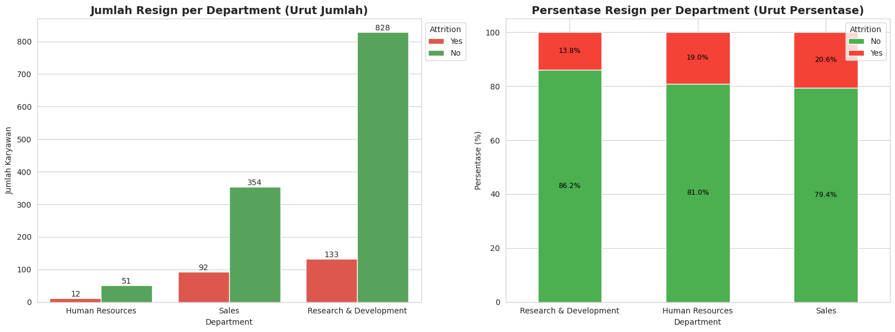
  Gambar 9. Tingkat Attrition Berdasarkan Department

10. Apakah Pengalaman Pendek (TotalWorkingYears) Mempengaruhi Resign?
    
    Tingkat attrition lebih tinggi ditemukan pada karyawan dengan pengalaman kerja (Total Working Years) yang lebih pendek. Hal ini wajar, karena karyawan dengan pengalaman terbatas sering kali masih dalam proses eksplorasi karier dan belum menemukan kecocokan ideal. Sebaliknya, pengalaman yang lebih panjang umumnya mencerminkan kematangan profesional dan komitmen yang lebih kuat terhadap perusahaan.

    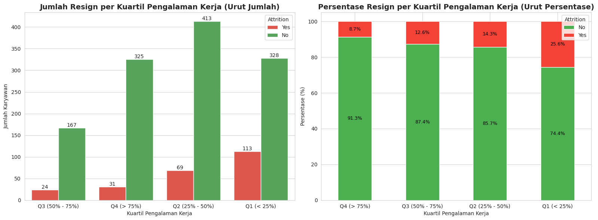
  Gambar 10. Attrition Berdasarkan Total Working Years

11. Apakah Kurangnya Promosi Mempengaruhi Keputusan Resign?

    Kurangnya promosi menjadi salah satu faktor penting dalam keputusan resign. Karyawan yang tidak mengalami peningkatan posisi dalam jangka waktu lama cenderung merasa stagnan dan tidak dihargai, sehingga memilih mencari peluang pertumbuhan di tempat lain. Sebaliknya, kesempatan naik jabatan mampu meningkatkan motivasi dan retensi karyawan secara signifikan.

    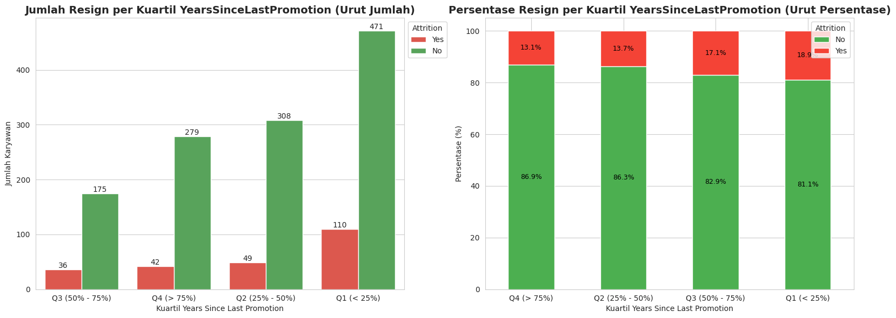
  Gambar 11. Attrition Berdasarkan Lama Tidak Dipromosikan

## Data Preprocessing

1. Penghapusan Fitur
    - Penghapusan Fitur Non-Informasi (Konstan)
    
      Beberapa fitur memiliki nilai yang sama pada seluruh entri sehingga tidak memberikan kontribusi informasi apapun dalam proses pembelajaran model. Fitur-fitur tersebut dihapus karena bersifat redundan:
      - `EmployeeCount`
      - `Over18`
      - `StandardHours`

    - Penghapusan Fitur dengan Korelasi Tinggi (>90%)
      
      Fitur `MonthlyIncome` memiliki korelasi sangat tinggi dengan variabel JobLevel. Untuk menghindari multikolinearitas yang dapat memengaruhi interpretabilitas dan akurasi model, fitur ini dihapus

    - Penghapusan Fitur Identifier

      Fitur `EmployeeNumber` hanya berfungsi sebagai pengenal unik tiap entri, tanpa memiliki nilai prediktif terhadap fenomena yang dianalisis. Oleh karena itu, fitur ini juga dihilangkan.

2. Feature Engineering

    Dalam upaya meningkatkan daya prediktif dataset, dilakukan rekayasa fitur dengan menambahkan beberapa variabel turunan yang mencerminkan dinamika pengalaman dan hubungan kerja karyawan. Fitur-fitur baru yang ditambahkan adalah sebagai berikut:
    - `YearsInSameRoleRatio` - Mengukur proporsi waktu seorang karyawan berada dalam peran yang sama dibandingkan dengan total pengalaman kerjanya. Rasio ini dapat mencerminkan stabilitas atau stagnasi dalam karier.
    - `YearsWithManagerRatio` - Menggambarkan durasi hubungan kerja dengan atasan saat ini relatif terhadap masa kerja di perusahaan. Semakin tinggi nilai ini, semakin lama karyawan bekerja dengan manajer yang sama.
    - `PromotionGap` - Mengindikasikan jarak waktu antara lama bekerja di perusahaan dengan waktu sejak promosi terakhir. Nilai yang besar bisa menjadi sinyal karyawan belum mengalami perkembangan karier, yang dapat memengaruhi keputusan untuk resign.

## Modeling & Result

Untuk memprediksi kemungkinan karyawan mengundurkan diri (attrition), dua model machine learning digunakan:

- Logistic Regression: Model linear yang mudah diinterpretasikan.
- Random Forest: Model ensemble non-linear yang menangkap hubungan kompleks antar fitur.

1. Logistik Regression

    Model ini memberikan hasil baik dalam mendeteksi karyawan yang tidak resign, namun masih kurang optimal dalam mengenali yang akan resign. Model ini memiliki ROC-AUC sebesar 0.82, menunjukkan kinerja klasifikasi yang baik secara keseluruhan.

    | Metode           | Precision | Recall | F1-Score | Support |
    | ---------------- | --------- | ------ | -------- | ------- |
    | Tidak Resign (0) | 0.89      | 0.97   | 0.93     | 370     |
    | Resign (1)       | 0.69      | 0.38   | 0.49     | 71      |
    |    **Akurasi**      |           |        | **0.87** | 441     |
    | **ROC-AUC**      |           |        | **0.82** |         |

    10 Fitur penting Logistic Regression:

    | Rank | Fitur                              | Koefisien |
    |    ---- | ---------------------------------- | --------- |
    | 1    | OverTime                           | +0.89     |
    | 2    | TotalWorkingYears                  | –0.70     |
    | 3    | JobRole\_Sales Executive           | +0.68     |
    | 4    | JobRole\_Laboratory Technician     | +0.66     |
    | 5    | BusinessTravel\_Travel\_Frequently | +0.66     |
    | 6    | JobRole\_Sales Representative      | +0.59     |
    | 7    | YearsWithManagerRatio              | –0.56     |
    | 8    | YearsWithCurrManager               | +0.50     |
    | 9    | NumCompaniesWorked                 | +0.50     |
    | 10   | EnvironmentSatisfaction            | –0.46     |

   Faktor seperti lembur (OverTime), frekuensi perjalanan dinas, dan jenis peran kerja sangat berpengaruh terhadap keputusan resign.

2. Random Forest
   
    Model ini lebih kompleks dan mampu menangkap pola yang tidak linear, namun kinerjanya kurang baik dalam mendeteksi karyawan yang resign (recall hanya 15%). Walau akurasi keseluruhan cukup tinggi, model ini cenderung bias terhadap kelas mayoritas (tidak resign)

    | Metode           | Precision | Recall | F1-Score | Support |
    | ---------------- | --------- | ------ | -------- | ------- |
    | Tidak Resign (0) | 0.86      | 0.97   | 0.91     | 370     |
    | Resign (1)       | 0.52      | 0.15   | 0.24     | 71      |
    | **Akurasi**      |           |        | **0.84** | 441     |
    | **ROC-AUC**      |           |        | **0.77** |         |

Perbandingan Model:

| Aspek                  | Logistic Regression | Random Forest     |
| ---------------------- | ------------------- | ----------------- |
| **Akurasi**            | 87%                 | 84%               |
| **ROC-AUC**            | **0.82**          | 0.77              |
| **Recall (Resign)**    | **38%**           | 15%               |
| **Precision (Resign)** | **69%**           | 52%               |
| **Interpretabilitas**  | Tinggi            | Rendah            |
| **Insight dari Fitur** | Jelas             | Kurang transparan |

## Conclusion

Proyek ini berhasil membangun sistem prediktif untuk mengidentifikasi karyawan yang berpotensi mengundurkan diri berdasarkan data HR.

- Temuan Utama:
    - **Faktor paling berpengaruh terhadap attrition** adalah `OverTime`, `TotalWorkingYears`, `YearsWithManagerRatio`, serta beberapa peran pekerjaan tertentu seperti `Sales Executive` dan `Laboratory Technician`.
    - **Karyawan dengan jam lembur tinggi, pengalaman kerja pendek, dan interaksi rendah dengan manajer** cenderung lebih berisiko untuk resign.
    - **EDA** menunjukkan bahwa usia muda, status pernikahan, jarak rumah, dan keterlambatan promosi juga berkorelasi dengan keputusan resign.

- Performa Model:
    - **Logistic Regression** memberikan keseimbangan terbaik antara akurasi dan interpretabilitas, dengan ROC-AUC 0.82 dan f1-score cukup baik pada kelas minoritas.
    - **Random Forest** memiliki akurasi keseluruhan yang tinggi, namun kurang efektif dalam mengklasifikasikan karyawan yang resign (recall rendah).

- Recommendation:

  1. Optimalkan Manajemen Lembur 

      - Jam kerja lembur (OverTime) adalah prediktor kuat terhadap attrition.
      - Rekomendasi:
        - Lakukan audit lembur secara berkala.
        - Implementasikan sistem rotasi atau workload balancing.
        - Berikan kompensasi atau benefit tambahan untuk karyawan dengan beban lembur tinggi.

  2. Tingkatkan Hubungan antara Karyawan & Manajer

      - Semakin lama seorang karyawan bekerja dengan manajer yang sama, semakin kecil kemungkinan mereka resign.
      - Rekomendasi:
        - Latih manajer agar mampu menjadi pemimpin yang suportif dan komunikatif.
        - Evaluasi performa manajerial secara berkala dari sisi engagement, bukan hanya output.

  3. Perhatikan Perjalanan Karier dan Promosi
      - Gap promosi yang terlalu lama bisa menjadi penyebab utama attrition.
      - Rekomendasi:
        - Tetapkan jalur karier yang jelas dan transparan.
        - Sediakan kesempatan pengembangan (training, mentorship, proyek khusus) untuk karyawan stagnan.
        - Evaluasi ulang sistem promosi berbasis objektif dan data.

  4. Retensi Karyawan Muda dan Level Rendah
      - Karyawan muda dan dengan job level rendah memiliki tingkat pengunduran diri yang lebih tinggi.
      - Rekomendasi:
        - Tawarkan program onboarding yang lebih intensif dan berkelanjutan.
        - Bangun sistem dukungan awal karier (peer mentor, coaching).
        - Berikan kejelasan mengenai prospek karier sejak awal.
  